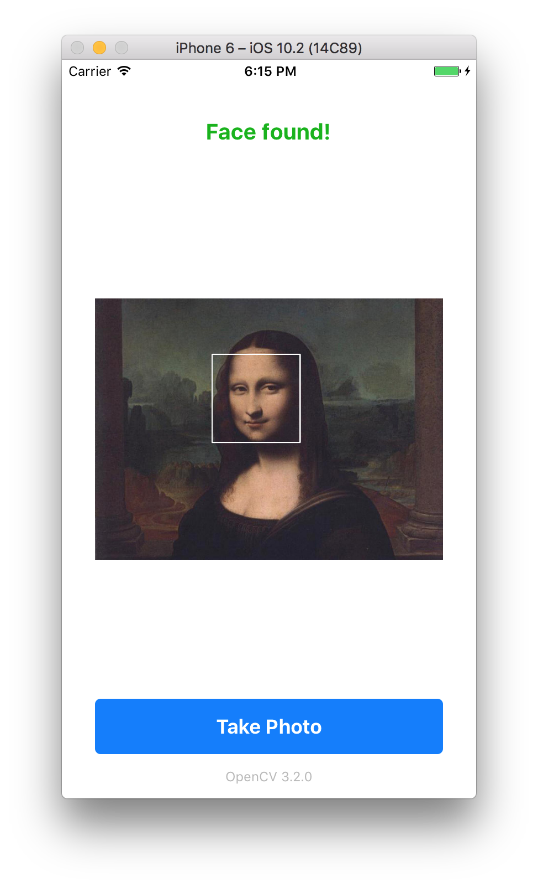

# Install
* Download iOS bindings for OpenCV: http://opencv.org/downloads.html
* Add framework to iOS project
* Build project (Command + B)

**Note:** For face detection on iOS, consider using the native [CIDetectorTypeFace]( https://developer.apple.com/reference/coreimage/cidetector/detector_types) detector.

# Example

